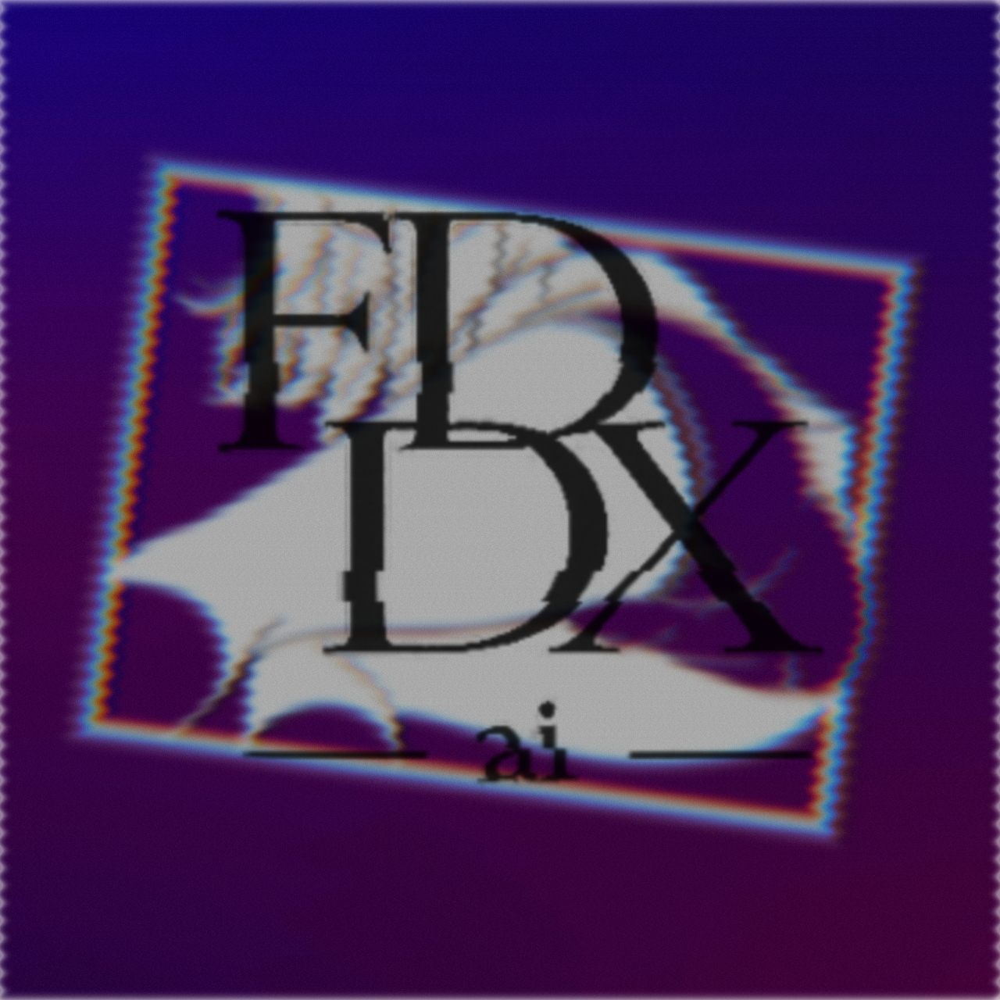

<div align="center">



# LayerLab

**A fast, offline photo editor for AI art and social posts.**

Layers · AI background removal · 20+ effects · batch watermarking · platform resizing
No subscription. No cloud. No account. Everything runs on your own machine.

Made by **FDDX** · [Support on Ko-fi](https://ko-fi.com/fancyddxai)

</div>

---

## What it is

LayerLab is a Windows desktop photo editor built for people who generate a lot of images and need to
prep them for posting — cut them out, stack them, grade them, watermark them, resize them for
Instagram or TikTok, and export the whole set in one go.

It's a single self-contained app. **Nothing is uploaded anywhere** — the AI background remover runs
locally, and the app works with no internet connection at all.

---

## Quick start

1. Download `LayerLab-v1.0.0-win-x64.zip` from [Releases](../../releases).
2. Unzip it anywhere.
3. Run **`LayerLab.exe`**.

No installer, no dependencies, no setup. Delete the folder to uninstall.

---

## Features

### Layers
- Base image plus unlimited image, text and watermark layers
- Move, scale and rotate — rotation **snaps to 90°** with a live degree readout (hold **Shift** for free rotation)
- Arrow keys nudge (**Shift** for bigger steps)
- Duplicate (**Ctrl+D**), delete (**Del**), rename (double-click the name)
- **Drag layer rows to reorder**
- Show/hide per layer, opacity, and **12 blend modes**
- **Center** and **Fit to canvas** to rescue a layer you've dragged off somewhere
- A working margin around the canvas so layers pushed past the edge stay visible instead of vanishing
- **Bottom filmstrip** — every layer as a thumbnail; click to select, double-click to show/hide

### Adjustments
Brightness · Contrast · Saturation · Blur · Black & white · Sepia · Hue · Vignette · White border

### Effects (GPU accelerated)
Chromatic aberration · Glitch · VHS · Film grain · Light leak · Pixelate · Halftone · Posterize ·
Threshold · Sharpen · Radial blur · **Duotone** (two colours) · **Split tone** (shadow + highlight colours)

### One-click looks
Polaroid · Soft BG · Vintage · B&W · Glitch · VHS · Light leak · Pixelate · Duotone · Halftone

### Layer effects
- **Sticker outline** with colour — turns a cutout into a sticker
- **Drop shadow** with colour — makes composites sit properly on the background

### Text
Multi-line content · 5 fonts · size · colour · alignment · outline (with colour) · shadow · bold · italic

### Censor brush
Paint over anything to **pixelate**, **blur** or **black-bar** it, with adjustable strength and brush
size. Undoable. Useful for posting a safe teaser publicly while keeping the original intact.

### AI background remover
- **Auto** — removes the background for you, running fully offline on your machine
- Edge controls: **sharpness**, **softness**, **shrink/grow** — re-tune instantly without re-running the AI
- **Manual brushes** — *Erase background* (samples the colour under the brush, so line art survives even
  if you brush slightly inside), *hard erase*, and *restore*
- **Right-click drag always restores**, whatever brush you're on
- Output as transparent PNG, a solid colour, or over a blurred version of the original
- Works on one image or a whole batch; send any cutout straight into the editor as a layer

### Watermark batch
- Import your own logo, with optional **white-background key-out**
- Place it **once** — the exact position and size apply to every image
- **Single** mark or **tiled diagonal** repeat (anti-repost)
- 9 snap positions + margin, opacity, size, blend mode, shadow and outline
- Export the whole batch in one pass

### Resize & crop
- Exact-pixel platform presets: **Instagram** (post, portrait, landscape, story/reel, profile),
  **TikTok**, **YouTube** (thumbnail, banner), **X**, **Facebook**, **Pinterest**, **Patreon**, plus custom
- **Drag to reframe** and zoom to choose exactly what's kept
- **Fill** (crop) or **Fit** (pad with a colour or a blurred copy)
- Rule-of-thirds grid, orientation swap, batch export
- Canvas-size presets are also available directly in the main editor

### Batch
- Apply any saved look to an entire folder
- Watermark a folder · remove backgrounds from a folder · resize a folder
- Set **one global export folder** and every export lands there automatically

### Workspace
- **Live RGB histogram** computed from your actual composition
- **History panel** — step back through everything you've done
- **Undo / redo** (**Ctrl+Z** / **Ctrl+Y**), 60 steps
- Menu bar, contextual tool-options bar, icon tool rail, status bar
- **Save and reopen projects** (`.llproj.json`) with all layers and settings intact

### Make it yours
- **7 theme presets** plus a full colour editor — background, panels, borders, text, muted text, accent
- Built-in colour picker (saturation/brightness square, hue bar, hex, presets)
- Use **your own picture as the app background**, with dim and blur controls
- Tooltips on everything

### Export
PNG (lossless) or JPG (with quality control) · 0.5× to 2× scale · live dimension readout

---

## Keyboard shortcuts

| Shortcut | Action |
|---|---|
| `Ctrl` + `Z` | Undo |
| `Ctrl` + `Y` / `Ctrl` `Shift` `Z` | Redo |
| `Ctrl` + `D` | Duplicate layer |
| `Del` | Delete layer |
| `←` `↑` `↓` `→` | Nudge layer (`Shift` = bigger steps) |
| `Shift` + rotate | Free rotation (disable 90° snapping) |
| Right-click drag | Restore brush (background remover) |
| Double-click layer name | Rename |

---

## Requirements

- Windows 10 or 11 (64-bit)
- ~1 GB disk space
- No internet connection required

---

## Building from source

The repository holds the source only — the Electron runtime and AI models are large binaries and are
distributed with the [Releases](../../releases) instead.

```powershell
# preview the UI in a browser (no Electron needed)
python tools/serve.py     # then open http://localhost:8899
```

To assemble the full desktop app, `scripts/build-app.ps1` downloads the Electron runtime, the ONNX
runtime and the AI models, then wires them together with `src/LayerLab.html`.

---

## Credits

LayerLab is built on excellent open-source work:

- **[Electron](https://www.electronjs.org/)** — desktop runtime (MIT)
- **[ONNX Runtime Web](https://onnxruntime.ai/)** — on-device AI inference (MIT)
- **[IS-Net / rembg](https://github.com/danielgatis/rembg)** — general background-removal model
- **[anime-segmentation](https://github.com/SkyTNT/anime-segmentation)** by SkyTNT — anime background model

Model weights are redistributed in the release build for convenience; all rights remain with their
respective authors.

---

## Licence

**Copyright © 2026 FDDX (FancyDDX). All rights reserved.**

The source is published so you can read it and see how the app works. It is **not** licensed for
reuse, redistribution or derivative works. See [LICENSE](LICENSE).

---

<div align="center">

If LayerLab is useful to you, [**buy me a coffee**](https://ko-fi.com/fancyddxai) ☕

</div>
